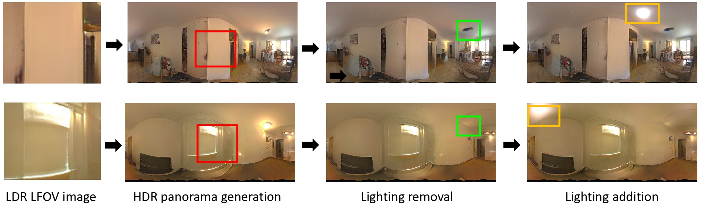

# StyleLight: 조명 추정 및 편집을 위한 HDR 파노라마 생성

### [프로젝트](https://style-light.github.io/) | [YouTube](https://www.youtube.com/watch?v=sHeWK1MSPg4) | [arXiv](https://arxiv.org/abs/2207.14811) 


>**초록:** 본 논문은 LDR(Low-Dynamic-Range) 카메라로 촬영된 단일 제한된 시야각(FOV) 이미지로부터 HDR(High-Dynamic-Range) 실내 파노라마 조명을 생성하는 새로운 조명 추정 및 편집 프레임워크를 제안합니다. 기존의 조명 추정 방법들은 조명 표현 파라미터를 직접 회귀하거나, 이 문제를 FOV-to-panorama 및 LDR-to-HDR 조명 생성 하위 작업으로 분해했습니다. 그러나 부분적인 관측, 높은 다이내믹 레인지의 조명, 그리고 장면의 내재적인 모호성으로 인해 조명 추정은 여전히 어려운 과제로 남아 있습니다. 이 문제를 해결하기 위해 우리는 LDR 및 HDR 파노라마 합성을 통합된 프레임워크로 결합한 결합된 듀얼-StyleGAN 파노라마 합성 네트워크(StyleLight)를 제안합니다. LDR 및 HDR 파노라마 합성은 유사한 생성기를 공유하지만 별도의 판별자를 가집니다. 추론 시, LDR FOV 이미지가 주어지면, 우리는 LDR 파노라마 합성 브랜치를 통해 잠재 코드를 찾기 위한 초점 마스킹 GAN 역전환(Focal-Masked GAN Inversion) 방법을 제안하고, 그 후 HDR 파노라마 합성 브랜치를 통해 HDR 파노라마를 합성합니다. StyleLight는 FOV-to-panorama 및 LDR-to-HDR 조명 생성을 통합된 프레임워크로 가져와 조명 추정을 크게 개선합니다. 광범위한 실험을 통해 우리의 프레임워크가 실내 조명 추정에서 최신 방법들보다 우수한 성능을 달성함을 입증했습니다. 특히, StyleLight는 실내 HDR 파노라마에 대한 직관적인 조명 편집도 가능하게 하여 실제 애플리케이션에 적합합니다.

[Guangcong Wang](https://wanggcong.github.io/), [Yinuo Yang](https://www.linkedin.com/in/yinuo-yang-489487245/), [Chen Change Loy](https://www.mmlab-ntu.com/person/ccloy/), [Ziwei Liu](https://liuziwei7.github.io/)

S-Lab, Nanyang Technological University

**European Conference on Computer Vision (ECCV)**, 2022 에서 발표됨

## 0. 업데이트

- [2023-04-19] 파노라마 wraping. 렌더링할 객체가 파노라마의 중심에 있는 경우, warping.py를 사용하여 파노라마를 warping할 수 있습니다.


## 1. 필수 조건
- Linux, Windows, 또는 macOS
- Python 3.8+
- NVIDIA GPU + CUDA 12.1
- PyTorch 2.1.0+
- OpenCV

## 2. 설치
코드를 쉽게 실행하기 위해 가상 환경(conda) 사용을 권장합니다.

### 기본 설치
```bash
conda create -n StyleLight_conda python=3.8
conda activate StyleLight_conda

# PyTorch 설치 (CUDA 12.1)
conda install pytorch==2.1.0 torchvision==0.16.0 torchaudio==2.1.0 pytorch-cuda=12.1 -c pytorch -c nvidia

# 필수 패키지
pip install lpips wandb matplotlib dlib imageio einops
pip install imageio-ffmpeg ninja opencv-python scikit-image
pip install click psutil scipy requests tqdm tensorboard
pip install skylibs colour-science

# OpenEXR (Linux: sudo apt-get install openexr libopenexr-dev 먼저 실행)
pip install OpenEXR pyexr
```

### Linux/WSL2 추가 설치 (CUDA 커널 JIT 컴파일용)
```bash
# GCC 12 설치 (CUDA 12.x는 GCC 12 이하만 지원)
conda install -c conda-forge gxx_linux-64=12

# nvcc 버전을 PyTorch CUDA 버전과 일치시키기
conda install -c nvidia cuda-nvcc=12.1

# CCCL 헤더 설치 (thrust, cub 등)
conda install -c nvidia cuda-cccl
```

**중요**: Linux에서 CUDA 커널 컴파일 시 다음 조건이 충족되어야 합니다:
- GCC 버전 12 이하
- nvcc 버전이 PyTorch CUDA 버전(12.1)과 일치
- CCCL 헤더 경로가 설정됨 (setup_env.py가 자동 처리)

자세한 설정 방법은 [setup_README.md](setup_README.md)를 참조하세요.


## 3. 학습
### 데이터셋 다운로드
- [공식 웹사이트](http://indoor.hdrdb.com/)에서 Laval 데이터셋을 다운로드하세요.

### 데이터셋 전처리
- data_prepare_laval.py에서 *Laval 데이터셋 경로(from_folder)*와 *전처리된 데이터를 저장할 경로(to_folder)* 변수를 설정하세요.
```
python data_prepare_laval.py
```
### StyleLight 학습
```
python train.py --outdir=./training-runs-256x512 --data=/mnt/disks/data/datasets/IndoorHDRDataset2018-128x256-data-splits/train --gpus=8 --cfg=paper256  --mirror=1 --aug=noaug
```
- --outdir: 모델과 생성된 예제를 저장할 경로
- --gpus: GPU 개수
- --data: 전처리된 데이터 경로
- --cfg: stylegan-ada 설정
- --mirror 및 --aug: 데이터 증강 옵션

### 또는 추론 모델 다운로드
- [Google Drive](https://drive.google.com/file/d/1vHfwrtgk0EjZlS14Ye5lASJ0R4IWl_4w/view?usp=sharing)에서 추론 모델을 다운로드하세요.


## 4. 테스트
### 조명 추정 및 편집
- PTI_utils/paths_config.py에서 경로(*stylegan2_ada_ffhq*)를 설정하세요.
- PTI_utils/hyperparameters.py에서 옵션(*lighting estimation* 또는 *lighting editing*)을 설정하세요.
```
python test_lighting.py
```


## 5. 할 일 (To-Do)
- [x] 학습 코드
- [x] 추론 모델
- [x] 평가 코드


## 6. 인용 (Citation)

연구에 도움이 되었다면 저희 논문을 인용해 주세요.

```
@inproceedings{wang2022stylelight,
   author    = {Wang, Guangcong and Yang, Yinuo and Loy, Chen Change and Liu, Ziwei},
   title     = {StyleLight: HDR Panorama Generation for Lighting Estimation and Editing},
   booktitle = {European Conference on Computer Vision (ECCV)},   
   year      = {2022},
  }
```

또는
```
Guangcong Wang, Yinuo Yang, Chen Change Loy, and Ziwei Liu. StyleLight: HDR Panorama Generation for Lighting Estimation and Editing, ECCV 2022.
```

## 7. 관련 링크
[Text2Light: Zero-Shot Text-Driven HDR Panorama Generation, TOG 2022 (Proc. SIGGRAPH Asia)](https://frozenburning.github.io/projects/text2light/)

[CaG: Traditional Classification Neural Networks are Good Generators: They are Competitive with DDPMs and GANs, Technical report, 2022](https://classifier-as-generator.github.io/)

[SceneDreamer: Unbounded 3D Scene Generation from 2D Image Collections, Arxiv 2023](https://scene-dreamer.github.io/)

[Relighting4D: Neural Relightable Human from Videos, ECCV 2022](https://github.com/FrozenBurning/Relighting4D)

[Fast-Vid2Vid: Spatial-Temporal Compression for Video-to-Video Synthesis, ECCV 2022](https://fast-vid2vid.github.io/)

[Gardner et al. Learning to Predict Indoor Illumination from a Single Image, SIGGRAPH Asia, 2017.](http://vision.gel.ulaval.ca/~jflalonde/publications/projects/deepIndoorLight/index.html)

[Gardner et al. Deep Parametric Indoor Lighting Estimation, ICCV 2019.](http://vision.gel.ulaval.ca/~jflalonde/publications/projects/deepIndoorLight/index.html)

[Zhan et al. EMlight:Lighting Estimation via Spherical Distribution Approximation, AAAI 2021.](https://github.com/fnzhan/Illumination-Estimation)


## 8. 감사의 글 (Acknowledgments)
이 코드는 [StyleGAN2-ada-pytorch](https://github.com/NVlabs/stylegan2-ada-pytorch), [PTI](https://github.com/danielroich/PTI), 그리고 [skylibs](https://github.com/soravux/skylibs) 코드베이스를 기반으로 합니다. 또한 경험을 공유해주신 [Jean-François Lalonde](http://vision.gel.ulaval.ca/~jflalonde/) 님께 감사드립니다.
